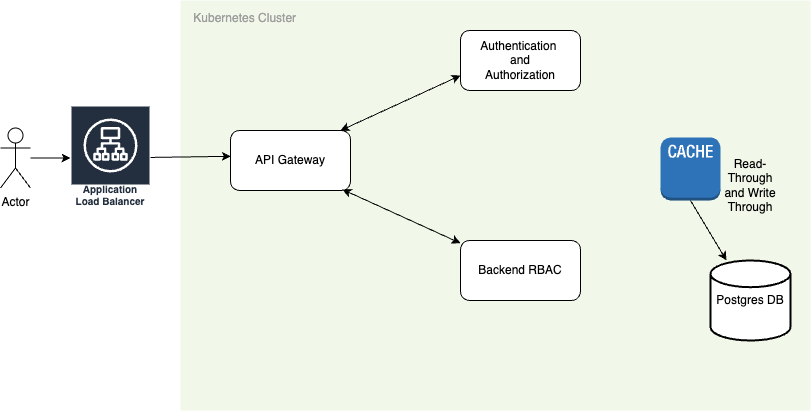

# Robust-backend-system-for-login
A robust backend system that enables multiple users to log in with various roles, granting them access to specific elements and components based on their assigned permissions.

URL : [GCloud](http://34.66.38.222/) 

## TO-DO
* Implement frontend support for ``` UPDATE``` persmissions in the ```Backend-RBAC``` microservice
* Make use of ```HTTPS``` for secured connections ( Move from ```requests``` module to ```urllib3``` module
* Implement CSRF Protection ( Flask module ```Flask-WTF``` )
* Microservices communication can made asynchronous (Message Queue)
* Acceptance Test and CI/CD


## Architecture




## Flow

### Login flow:
* Fresh browser makes a request for a specific resource
* Gateway service detects the absence of the jwt cookie and redirects to login form
* Login form talks to auth-service via gateway. Gateway allows non-jwt calls only to auth-service
* Auth service gives a login-form a newly created jwt cookie and redirects to original URL
### Normal operation:
* Browser makes a request for a resource along with jwt cookie
* Gateway service intercepts the request and forwards jwt to auth-service for validation
* Auth service checks signature then timestamp then blacklist and returns a positive or negative result
* If positive, Gateway service forwards the request to respective backend service, otherwise redirects to login
* Backend service does not do jwt validation - it just trusts the gateway to send only valid requests.
* Backend service does check for roles/permissions/entitlements defined in jwt
### Logout flow:
* Browser makes a request to the auth-service/logout
* Auth service puts the jwt in blacklist and redirects to login form


## Design Patterns

### API Gateway Pattern

When you design and build large or complex microservice-based applications with multiple client apps, a good approach to consider can be an API Gateway. This pattern is a service that provides a single-entry point for certain groups of microservices. It's similar to the Facade pattern from object-oriented design, but in this case, it's part of a distributed system. The API Gateway pattern is also sometimes known as the "backend for frontend" (BFF) because you build it while thinking about the needs of the client app.

Therefore, the API gateway sits between the client apps and the microservices. It acts as a reverse proxy, routing requests from clients to services. It can also provide other cross-cutting features such as authentication, SSL termination, and cache. ( Source : [Link](https://learn.microsoft.com/en-us/dotnet/architecture/microservices/architect-microservice-container-applications/direct-client-to-microservice-communication-versus-the-api-gateway-pattern))

### Decorator

* Used decorator for implementation of jwt tokem requirement ( ``` @jwt_required```) in the Authentication and Authorization microservice. Basically this was used to make sure that the jwt token is part of the HTTP request ( either through ```HEADER``` or ```COOKIE```).

* Used decorator to implement ``` @role_required``` in the backend-RBAC microservice to support role based access control. Here, Each route accessing or modifying the resource would be protected by actually checking the identity of the sender  ( ```get_jwt_identity()```) and also the organization he/she is a part of

### Microservices architecture

* Decoupling functions to accelerate development and promote continous delivery and integration


### JWT token flow


* Authentication and Authorization service on login sends back the acces token (``` lifetime :15 minutes```) and refresh token ( ``` lifetime : 7 days```) to gateway service as the response. Gateway then sets these 2 tokens as http only cookies (``` XSS Protection```) to the client so that he can authorize himself with them every time he wants to access any resource on the server.
* If the access token expires, the ```Auth ``` service issues a access token to the client by verifying the integrity of the refresh token.
* If the refresh token expires, client will be logged out.
* Access token is used by Backend service to identify the user accessing the system
* All token on expiry are put into a blocklist on ``` Redis``` which would be checked everytime a token is passed to the ``` Auth service ``` to make sure that hackers don't exploit any vulnerabilities using these expired tokens.
* When user logs out, The ``` HTTPOnly``` cookie are deleted on the client and both the JWT token are put in  the blocklist


### Database - Postgres DB

* Used a ```Helm``` chart to deploy a ```read-write replica``` for scalability purposes

* Used ``` SQLAlchemy ``` on ```Flask``` as the ORM to read, write and update the database.

#### Schema
```   
            CREATE TABLE IF NOT EXISTS Users (id serial PRIMARY KEY, name varchar NOT NULL, email varchar NOT NULL UNIQUE, password varchar NOT NULL);
   
            CREATE TABLE IF NOT EXISTS user_organization_roles (user_id INTEGER, organization_id INTEGER, role TEXT, PRIMARY KEY (user_id, organization_id));
    
            CREATE TABLE IF NOT EXISTS organizations (id INTEGER PRIMARY KEY, name VARCHAR);

            CREATE TABLE IF NOT EXISTS staff (id INTEGER PRIMARY KEY, name VARCHAR(100) NOT NULL, salary INTEGER NOT NULL, designation VARCHAR(100) NOT NULL);
  
            CREATE TABLE IF NOT EXISTS students (id INTEGER PRIMARY KEY, name VARCHAR(100) NOT NULL, course_name VARCHAR(100) NOT NULL, course_grade VARCHAR(100) NOT NULL);
```

### Redis Cache Store

* Used read write replica with the help of ```Sentinel```. Used to store key information  which rarely changes and is used repeatedly

* Used LRU as the Key eviction startegy

* Used ```Read-through``` and ```write-through``` caching mechanism


